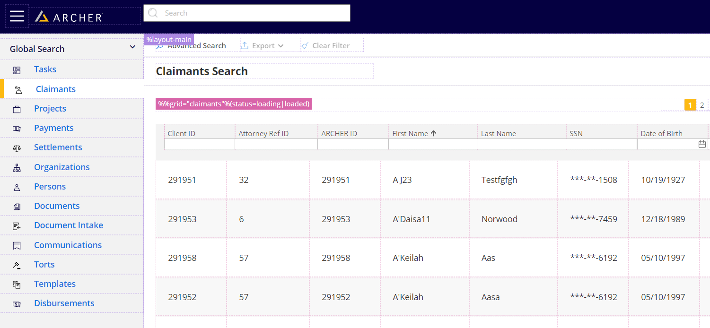

# Element Lookup Assistant
In non-production environment you can use `CTRL+ALT+T` to activate the **Element Lookup Assistant** that allow you to look up a particular element very quickly.

Click on a custom- or a pseudo-selector name to copy it to the clipboard and use it in your test cases along with `q` helper.
Click on a selector with a pressed `CTRL` key to copy a full path to the element (but remember it's not necessary to use a full path to reach the element, keep it as short as possible).

You can also use `CTRL+I` to change tooltip positioning if tooltips start to cover each other.

---

