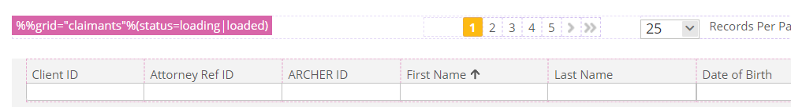

# Test Attributes
## Reaching elements philosophy
When you are writing e2e auto-tests the first problem you are facing
is how to reach a particular element on the page to interact with.
Developers and qa engineers often rely on css classes, but that approach has at least one issue:

> css classes are not trustworthy because they are
responsible only for element appearance and can be changed any time by developers who will have no idea it may break some of e2e tests.

The best practice that helps to solve this problem is to rely on test-id attributes like `data-test-id` along with a text-content that users can see.

So instead of writing something like this:
```ts
cy.get('button.login-btn').click();
```
We are doing this:
```ts
cy.get('[data-test-id="login-btn"]').click();
// Or the same with q helper
cy.get(q`%login-button`).click();
```
or this:
```ts
cy.get('button:contains(Login)').click();
```
---

## `data-test-id` attributes
Many of app components are populated with test-id attributes, 
but sometimes you are going to need to cover some uncovered components.
Doing this try to follow next rules:
- Only cover elements which user **can interact** with 
  or elements which **contain** some **business-related information**.
- Use `block-element` naming and keep it flat. \
Example:
```
%topnav
%topnav-logo
%topnav-toggle-btn
```

## `data-test-*` attributes
Sometimes you may need to attach some additional test data to the element, 
feel free to use your own data-test attributes for these purposes.
A good example of using such attributes is a `data-test-status` attribute of the `%%grid` component.


## `data-test-*-spec` attributes
When you are adding custom test-attributes that may contain variable values
don't leave them without any hints for qa engineers and other developers, 
use `data-test-*-spec` attribute to describe the possible values:
```html
<div
  data-test-id="foo"
  [attr.data-test-bar]="barValue"
  data-test-bar-spec="baz|qux">
</div>
```


